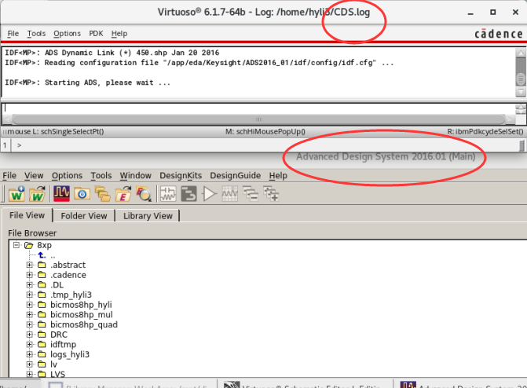

# 

## 1. Open in Terminal
右键Open the terminal--> 输入指令"cd /app/proj/++yourusername++/8xp" 回车----> "source cshrc_8xp" 回车------> "rfde &" 回车 PS.必须用这个指令打开才能创建动态链接。

## 2. Create Dynamic Link
在cadence中，把你想链接到ADS中的电路的schematic（已创建了symbol）打开，会出现如下页面，在如图所示位置点击创建动态链接，ADS会自动打开。（必须是这种情况下打开的ADS才有效）

正常情况下打开的界面会如下图所示：

## 3. Insert a template（不是必要项目）
我们往往需要利用的是ADS中的一些类似source-pull & load-pull等模版，对有源电路进行设计，这时就可以用ADS中提供的模版，如果你只是想自行设计，可忽略此步骤。可以按如下图插入模版，以及下下图中红圈里的Insert里也有一些模版。

## 4. Add Instance from Cadence
现在插入我们刚刚链接过来的电路，按如下图所示即可，记得要插入NETLIST INCLUDE！并点击对里面的文件进行补充修改，看图：

注意：这个SelectDesign往往不是自动弹出，你的在右下角任务栏里点击出这个界面。

现在可以继续按你的需要创建电路啦！是可以仿真的。
