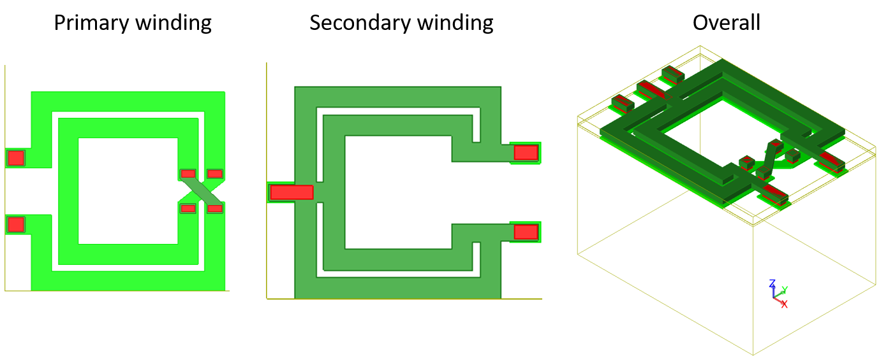

## Design of transformer balun
##中心频率28.0GHz, 单端阻抗50Ω，差分阻抗10Ω，插损1dB左右
##Case I. Turning ratio 1:2, overlay geometry.
(1)Configuration

(2)Extracted results

(3)Impedance matching

* The insertion loss is too large!

##Case II. Modified, the single turn is implemented by two branches connected in parallel to reduce series resistance.
(1)Configuration

(2)Extracted results

(3)Impedance matching

* The insertion loss is reduced!

(4)Magnitude and phase imbalance

