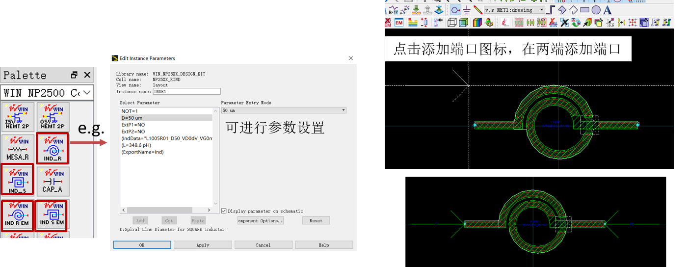

## EM simulation of inductor using ADS
### 1.新建Layout

### 2.Layout窗口界面

### 3.放置电感（两种方式），添加仿真端口
###（1）直接从元件库选择

*基底介绍：点击基底设置，可以观察基底的各层构成

*点击3D视图，可以观察电感在基底上的位置结构，可见电感布局在MET1、VIA2和MET2层

###（2）受元件库提供电感元件感值的限制，有时需手动建电感模型，再添加端口

*点击3D视图，可以观察建立的电感模型

### 4.点击仿真设置，设置Frequency plan, 点击仿真按钮进行仿真，仿真结束，点击Create EM Model and symbol

### 5.新建Schematic，添加扫频控件，端口等，并将刚仿真生成的symbol拖动到原理图窗口，按照图示进行连接，点击仿真

### 6.仿真结束会自动弹出结果窗口，插入Equation，得到提取的电感值、寄生电阻和Q值

## EM simulation of transformer using ADS
### 1.Transformer

### 2.在ADS中新建layout，构建模型，进行仿真，生成symbol（参考电感仿真过程）

### 3.在ADS中新建Schematic，按照如图所示连接，将初级和次级线圈一端接地，简化为二端口网络，进行仿真，参照文献公式进行参数提取

*参考文献

[1][V. N. R. Vanukuru, "Highly efficient and symmetric stacked transformers for millimeter-wave ics," 2017 International conference on Microelectronic Devices, Circuits and Systems (ICMDCS), Vellore, 2017, pp. 1-4.](http://ieeexplore.ieee.org/stamp/stamp.jsp?tp=&arnumber=8211712)

[2][L. Lin, W. Yin, J. Mao and K. Yang, "Performance Characterization of Circular Silicon Transformers," in IEEE Transactions on Magnetics, vol. 44, no. 12, pp. 4684-4688, Dec. 2008.](http://https://ieeexplore.ieee.org/stamp/stamp.jsp?tp=&arnumber=4711309)

### 4.在结果窗口插入Equation，得到提取的初级和次级线圈电感值、互感、Q值，以及MAG

