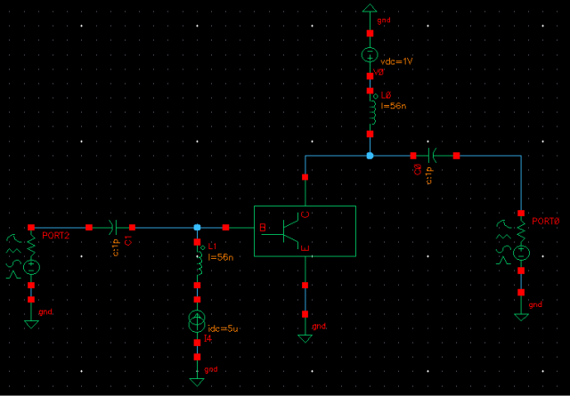
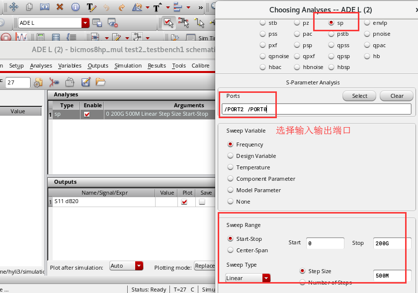
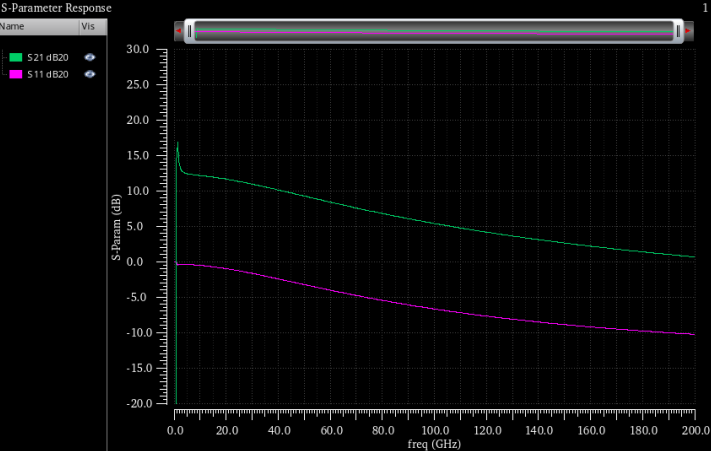
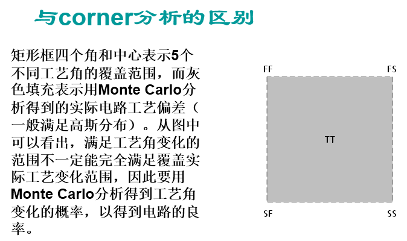

# S参数仿真
1. 新建schematic，放入之前创建的symbol，按如下图创建用来仿真S参数的testbench电路。用理想的电流和电压源提供输入电流Ib和工作电压Vce，输入输出端口提供信号。

2. 按如下图设置仿真环境，选择"sp”，扫描频段从0到200GHz，选定输入输出两个端口。

3. 运行仿真后，按如下图查看仿真结果。对于放大器而言，S21大于0dB。

* 可得到如下S21的仿真结果，（仅供参考）

# 工艺角Corner仿真

# MC（Monte Carlo Sampling）仿真
1. Corner和MC仿真的关系：

2. 如何进入MC仿真：

3. 设置界面中，各项的作用：

