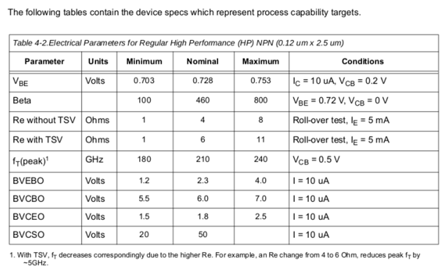

# The key point about BJT
## The structure
* 为辅助理解IC中BJT的实现与设计，可以从简单截面图中理解BJT的NPN结构。

* 我们用到的SiGe工艺是“213”的六层金属工艺，具体的层介绍如下图：

*  每一层的层厚也需要注意，具体如下：

## Layout-cadence
* 工艺中用到的NPN器件的性能参数如图，分为HP 和 HB两种：

*  cadence中观察到有如下六中BJT的layout结构，我将其分成两大类，一类直接CBE结构，一类有对称的C-B。如下图所示

Tips：The emitter length can be scaled to obtain the desired current rating with a minimum length equal to 0.52 um and a maximum length of 18 um.

* 当我们探究工艺中具体用到的层时，可能需要了解下列Mask的含义与作用。

## Principles about BJT
* BJT的工作原理简介：

