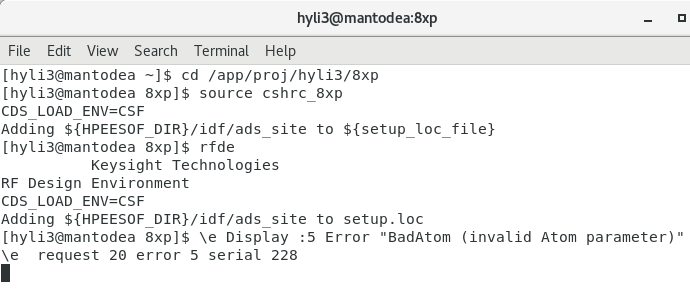

# Momentum in Cadence: the example of Inductor
## 1. Open Momentum in Cadence
在终端或者MobaXterm直接输入如下指令，即可打开内含ADS仿真的Cadence。

## 2. Inductor
在工艺库中，我们可以直接获得下面两类电感，一类的输入输出端口在同一金属层，完全对称；另一类通过过孔引出端口到同一位置，但在不同的金属层。具体可在图中看出：

很多情况下，我们需要自己创建不同线宽、内径、圈数的电感，这里有在Cadence里画折线的一个简易教程，目前我是根据这种方式DIY新的电感。

## 3. Simulation
创建好一个简易的电感之后，在两个末端，画入矩形端口“PIN”，作为输入输出端口。点击Launch-Momentum，出现仿真环境设置窗口，在这里，可以先详细看一下"Help"里的教程，可以注意看一下端口设置中关于Differential Ports的建立。这里的所有步骤都可以参考 
“Inductor and Transformer(EM Simulation)momentum by Wanli Zhan”
<https://github.com/very3b/2019icprojects/blob/master/Simulation%20of%20an%20inductor%20using%20ADS/Procedure.md>

## 4. Results
仿真结束后自动弹出空白结果页面，我们调用二端口的电感模版，可得到如下图所示的结果。

注：在变压器仿真中，我们仿真的是S参数或Z参数，需要用到转换公式获得初级次级线圈的自感和互感值等性能指标，具体的转换公式在上面链接里有呈现。