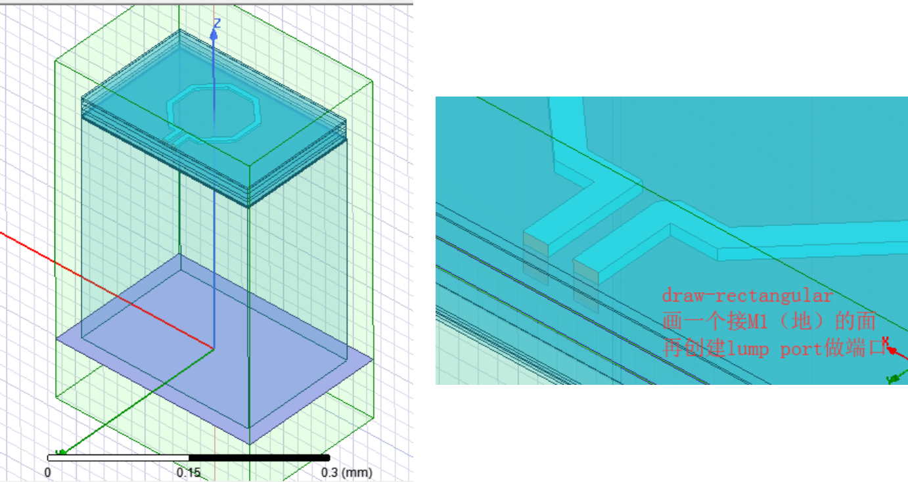

# Virtuoso&HFSS
## 1. export .gds from layout in Cadence
.gds后缀的电路文件可以在HFSS中结合.tech的工艺文件实现无源电路的仿真，下图是导出步骤：直接在cadence的主界面点到“streamout”,这里要注意选择layer map里的“use automatic layer mapping”，在导入HFSS中才会出现正常的层结构（经验之谈）。

## 2. import .gds to HFSS
打开hfss，建议不在服务器里的hfss中进行画图和设置操作，流畅度受限。按如下图导入.gds文件和.tech的文件。

## 3. simulation in hfss
要注意的是，为了保证导入的电路在坐标原点，在cadence里创建的layout也要在中心。
导入后，先设置材料属性，我们用到铜和铝两种材质的金属，右下角的层结构和材料图也可以帮助理解。

接下来就是HFSS的常规仿真，按如下方式设置端口后，添加扫频范围，开始仿真。下图是简单的电感示例。

