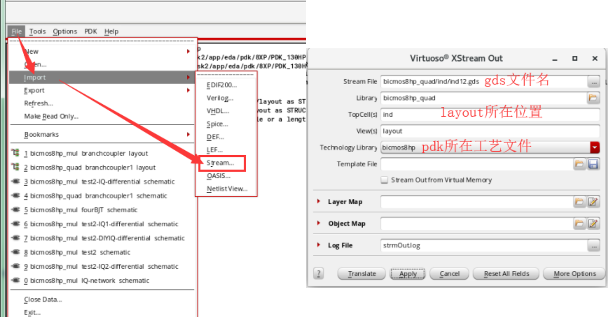
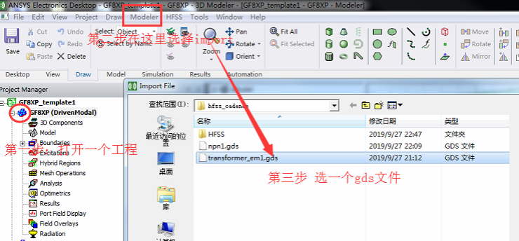
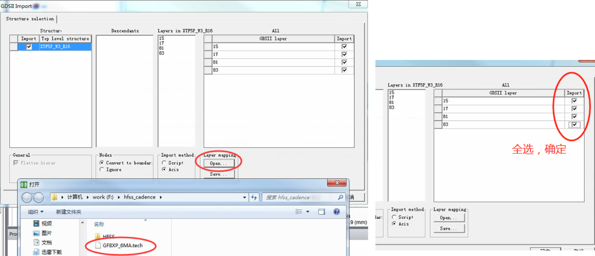
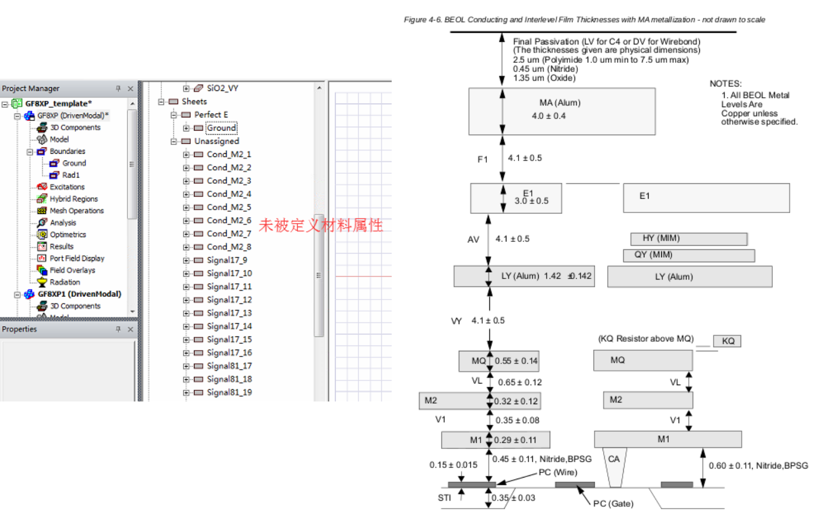
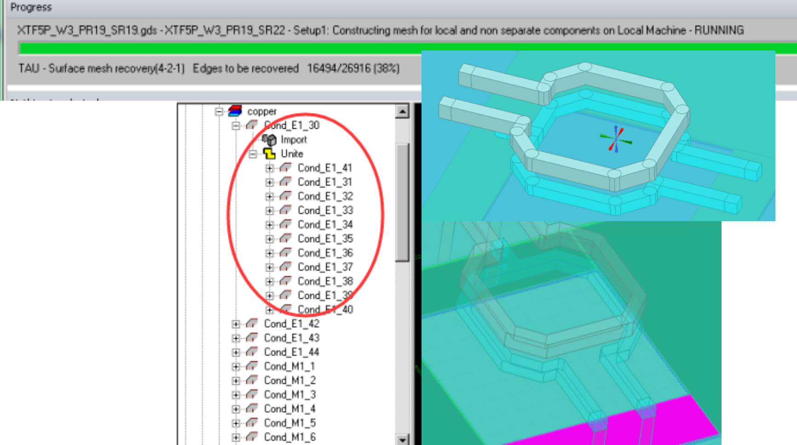
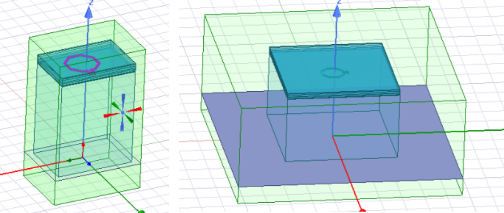

# Virtuoso&HFSS
## 1. export .gds from layout in Cadence
.gds后缀的电路文件可以在HFSS中结合.tech的工艺文件实现无源电路的仿真，下图是导出步骤：直接在cadence的主界面点到“streamout”,弹出右边窗口，自己定义gds文件放置位置和文件名；选择cadence里你要导成gds文件的layout文件；以及我们用的工艺文件。

## 2. import .gds to HFSS
打开hfss，建议不在服务器里的hfss中进行画图和设置操作，流畅度受限。按如下图导入.gds文件和.tech的文件。这里的tech文件是能否成功导入的关键，要注意单位问题。我们用到的tech文件厚度要统一乘以1000。注意的是，导入gds有两个格式选择：Script和Acis。前者可以实现对模型进行编辑。按需选择。

## 3. simulation in hfss
### 建模
要注意的是，为了保证导入的电路在坐标原点，在cadence里创建的layout也要在中心。
导入后，先设置材料属性，邮件Assign Material;在Search的地方键入 "Cond"，能找到对应的材料，右下角的层结构和材料图也可以帮助理解。

### BUG排除
接下来就是HFSS的常规仿真，按如下方式设置端口后，添加扫频范围，开始仿真。但是我们很有可能遇到仿真划分网格出错等的bug，下面总结了两个可能原因。

#### 第一种 导入的gds文件有问题
如下图所示，导入的gds里，电感就分成了很多个小模块，在HFSS中肯定要Unit合并才能仿真，但是可能因为模块太多，HFSS划分网格困难。所以导入的时候，尽量简化结构的模块。

#### 第二种 空气盒子和衬底尺寸不合适

如下图所示，我在用左图仿真时会出现问题，但是修改到右图的结构后可以完成仿真。所以合适的空气盒子以及整体结构尺寸比例可能也会造成仿真出错。
