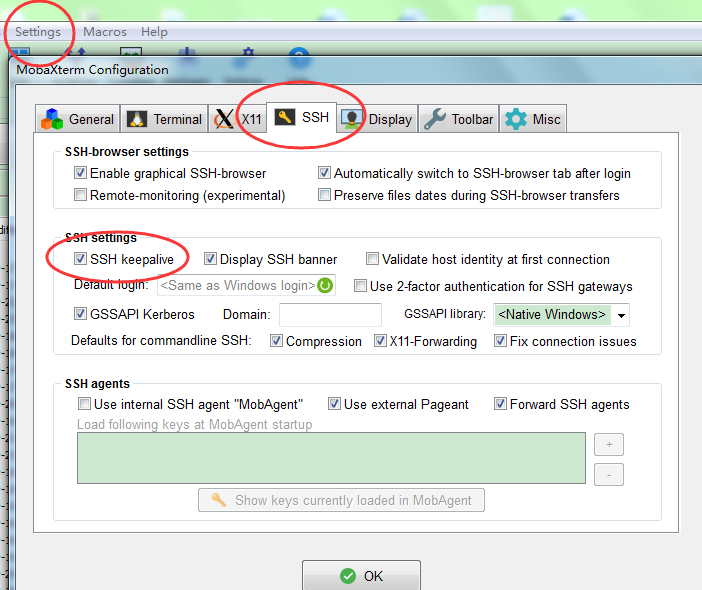
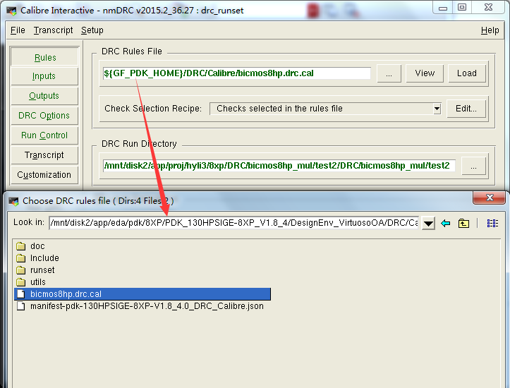
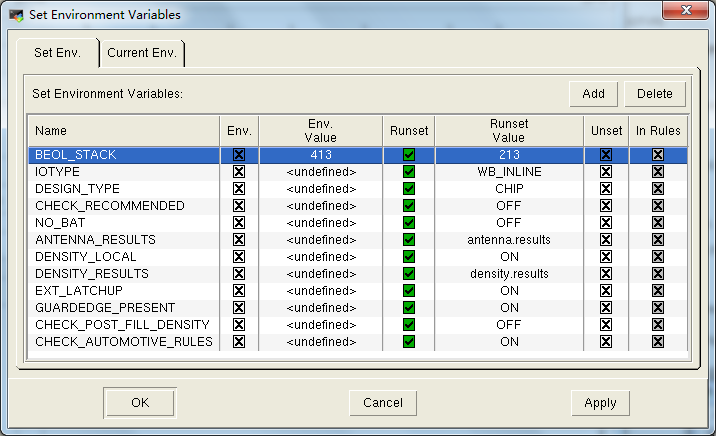
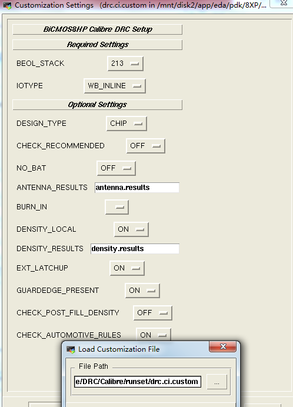
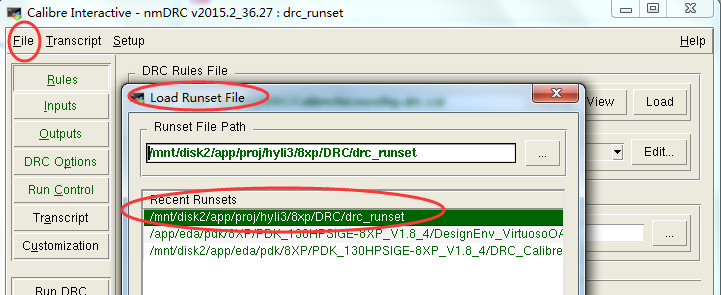
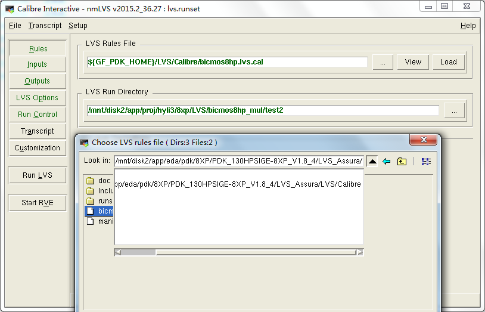
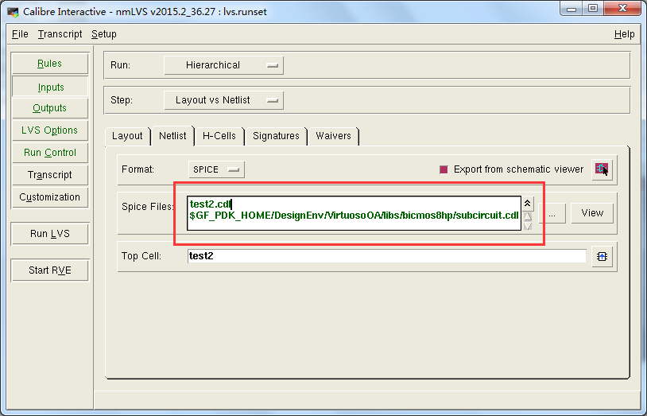
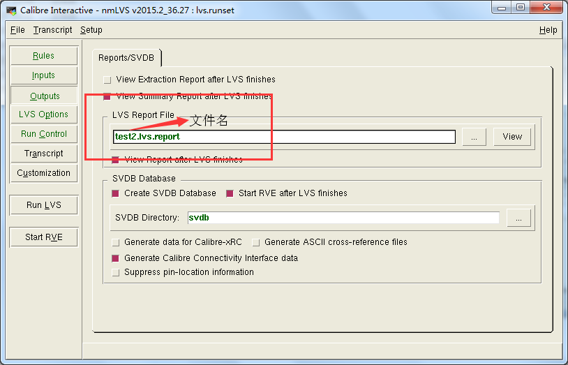

# Step1.MobaXterm上配置VCN端口

 1.Open MobaXterm，click New session--SHH，在Remote host中输入10.20.20.46
 
 2.依次输入如下指令,每输入一个指令都按回车键：“10.20.20.46”，“123sustc”，"vi .cshrc"，"vncs", 自动创建端口n。
 
 3.打开vncs，输入server address：10.20.20.46：n，输入统一密码即可登陆。

# Step2.VNC平台打开cadence

 1.右键Open the terminal--> 输入指令"cd /app/proj/++yourusername++/8xp" 回车----> "source cshrc_8xp" ------> "virtuoso &"
 
 2.要打开一个Library列表里包含 bicmos8hp 的PDK文件才算能正常使用cadence！新建Library时， 记得Attach to an existing technology library，在lib里可新建schematic&layout。新建后可以重新打开一下cadence查看是否能同时打开包含bicmos8hp和自己新建的lib。

PS.也可通过MobaXterm打开cadence，但是要注意进行如下设置，关闭软件的自动关断功能。

# Step3.配置calibre-DRC文件（需要手动给PDK中的runset文件里的DENSITY-RESULTS一列打勾）
 1.按如下图选择文件，具体为“/mnt/disk2/app/eda/pdk/8XP/PDK_130HPSIGE-8XP_V1.8_4/DesignEnv_VirtuosoOA/DRC/Calibre/bicmos8hp.drc.cal”

* 里面具体的设计细节如下图展示，一开始从“/mnt/disk2/app/eda/pdk/8XP/PDK_130HPSIGE-8XP_V1.8_4/DRC_Calibre/DRC/Calibre/runset/drc.runset”中调用的runset文件可能运行不来DRC，需要手动修改runset文件里的“density-results”打勾，同一行的“reset”也打勾。（在左上角的File和Setup里打开这些文件）

* 最后可以把设置好的runset文件另存一个文件，可以仿照下列 路径保存，以后就直接Load该文件，会自动弹出Customization Settings，记得要选择STACK为213。

 
# Step4. 配置calibre-LVS文件（直接按下图所示的路径配置）

* 使用DRC验证时，一定要把原理图里的所有的端口都在版图里设置后再进行。
