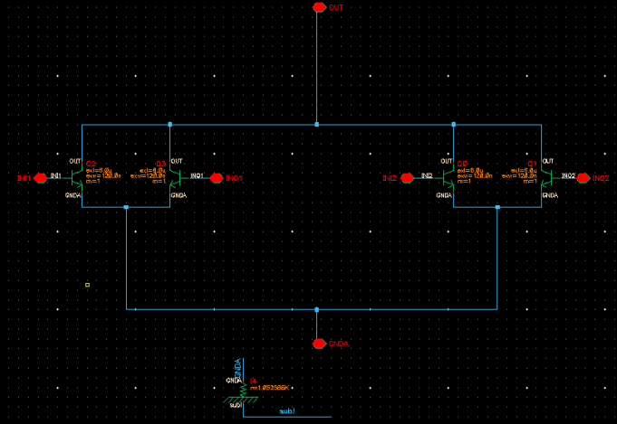
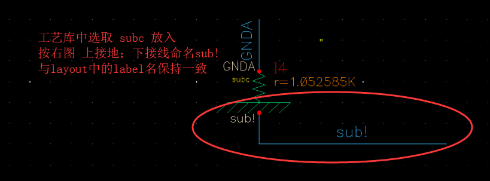
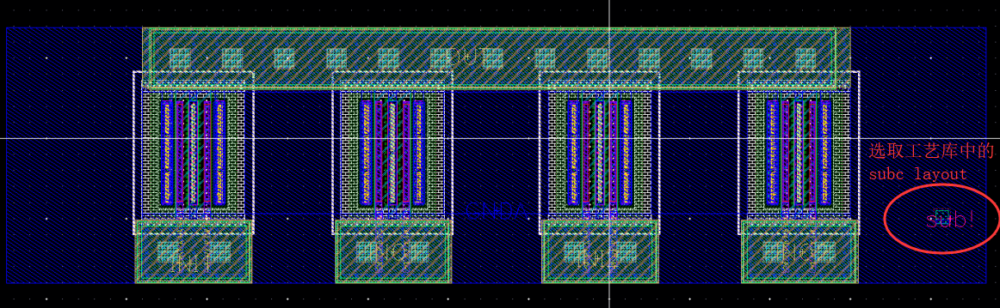
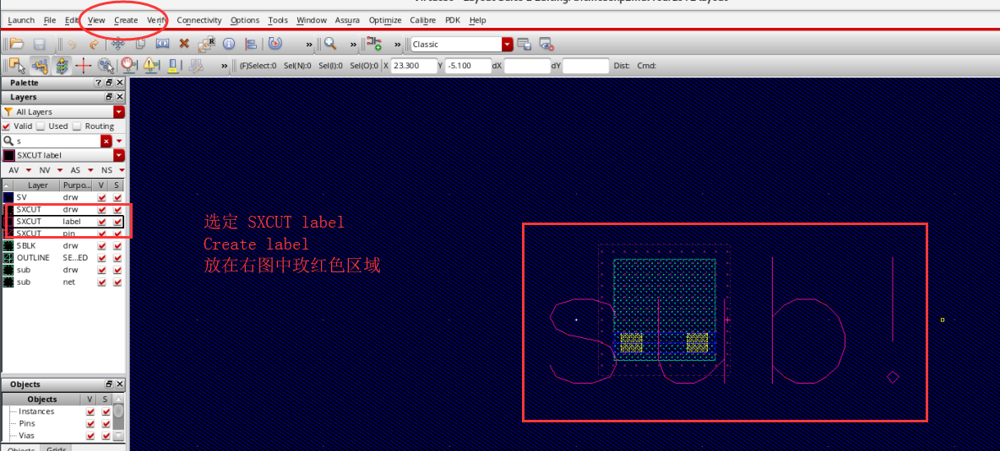
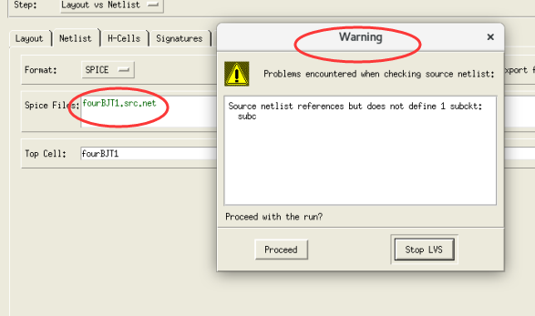
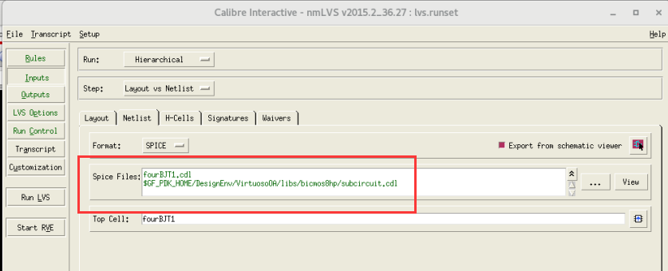

# SET UP sub in schematic and layout

## 1. schematic

在进行LVS之前，需要在原理图和版图中创建好衬底才不会出现报错。原理图中，“I”键插入元件库中的“subc”，整体如下图所示：

具体来看，电阻端接地，下端连一根线出来，命名为“sub!”，具体如下图：

## 2. layout

对应的，在Layout中，也插入工艺库中“subc”的layout文件，放在“GNDA”对应层上，整体图如下图所示：

具体来看，需要在外圈“BP”层对其命名，也就是建立label，在左侧选层处选定“SXCUT label”,Creat处选择label，命名"sub!"，具体可看下图。

## 3. Debug error in LVS

在LVS，或许会遇到下面的错误，提示Netlist有问题，这时是Runset文件没有设置好，也就是这里的Spice Files文件没设置对。

正确的话会是这样的界面：

### 欢迎大家补充LVS中遇到的bug